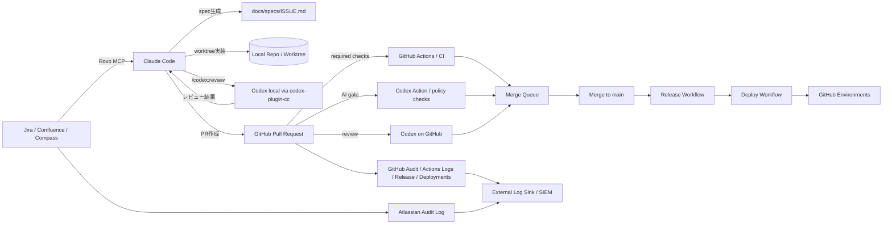

# 01. 目標アーキテクチャ

## 1. 全体像

## 2. 役割分担

| レイヤ | 主担当 | 役割 |
|---|---|---|
| 文脈取得面 | Atlassian Rovo MCP | Jira/Confluence/Compass の取得 |
| ローカル制御面 | Claude Code | 仕様化、実装、hooks、作業制御 |
| セカンドオピニオン面 | Codex plugin / Codex GitHub | 通常レビュー、対立的レビュー、長時間調査 |
| 最終統制面 | GitHub | PR、required checks、merge queue、release、deploy |
| 監査面 | GitHub + Atlassian + 外部ログ | 誰が何を根拠にどこまで進めたかの証跡 |

## 3. 信頼境界
### 3.1 ローカル端末
- もっとも自由度が高く、もっとも危険でもある
- ここでは hooks・sandbox・protected paths で先に抑止する
- ローカルから直接 `main` へ push / merge / release しない

### 3.2 GitHub
- 最終的な state transition をここへ集約する
- merge queue / required checks / environments / attestations を承認実体にする
- 人間が後追い調査するときも、まず GitHub を見る

### 3.3 Atlassian
- 「なぜやるか」「何を満たすか」の正本
- ただし live 文脈のまま長い実装に流さず、一度 spec 化して repo 内へ固定する

## 4. 標準フロー
1. Claude が Jira / Confluence を Rovo MCP 経由で取得
2. Claude が `docs/specs/<ISSUE>.md` を生成
3. Claude が worktree 上で実装
4. hooks が format / lint / typecheck / test / policy を強制
5. Codex が review / adversarial review を実施
6. Claude が修正して PR を作成
7. GitHub Actions が CI / AI gate / security / spec gate を実行
8. required checks が揃うと merge queue へ
9. GitHub が自動マージ
10. release workflow が tag / release / attestations を生成
11. deploy workflow が staging / production へ
12. GitHub と Atlassian のログが外部監査基盤へ集約

## 5. 非採用パターン
### 5.1 tmux send-keys を主経路にする
- 視覚的には便利でも、最終状態・承認・証跡の正本になりにくい
- 観測 UI としてはよいが、統制面には向かない

### 5.2 Cloud 側へ直接 Jira live 文脈を持ち込む
- 権限、監査、再現性が複雑になりやすい
- spec 化して repo に凍結した方がレビューしやすい

### 5.3 標準経路で bypass を使う
- 監査と説明責任が悪化する
- 標準経路は正規の checks / queue / environments を通す
