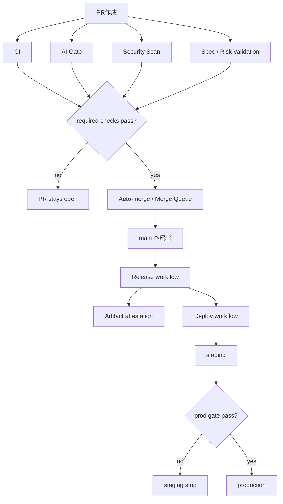

# 03. 機械承認・自動マージ・自動リリース・監査証跡

## 1. 結論
本設計では、**人間の Approve を通常系の必須条件にしない**。  
代わりに以下を「承認の実体」とする。

- GitHub rulesets
- required status checks
- merge queue
- release workflow
- deploy workflow
- GitHub Environments
- artifact attestations
- 外部ログ基盤へのイベント転送

つまり、**承認 = 機械判定の集合**として定義する。

## 2. 標準レーン

## 3. 役者の定義

| 役者 | 役割 | 許可すべきこと | 禁止すべきこと |
|---|---|---|---|
| Claude local | 実装・spec 生成・PR 準備 | worktree 内編集、ローカル検証 | merge / release / prod deploy |
| Codex local | クロスレビュー・調査 | review、background rescue | main 更新、release 操作 |
| GitHub App | 組織的な機械 actor | merge queue 投入、PR 更新、release 操作 | ローカル端末操作 |
| GitHub Actions | CI / gate / release / deploy | required checks、artifact 作成、deploy | repo 外の不要権限使用 |
| Human | 監視・設計・例外対応 | break-glass 実施、ポリシー更新 | 標準系での手動 merge 必須化 |

## 4. 標準系の GitHub 設計
### 4.1 branch / ruleset
- `main`: merge queue 必須
- `release/*`: さらに厳しい ruleset
- push 直打ちは禁止
- PR 経由のみ

### 4.2 required checks の標準セット
- `ci`
- `spec-gate`
- `risk-classification`
- `security-scan`
- `ai-gate`
- `release-ready`

### 4.3 auto-merge と merge queue
- auto-merge を有効にする
- busy branch では merge queue を優先する
- required workflows は `pull_request` だけでなく `merge_group` にも対応する

## 5. AI gate の考え方
### 5.1 GitHub 上の Codex review は補助
GitHub 上の Codex review は便利だが、P0/P1 中心の重大指摘寄りである。  
したがって以下に分ける。

- **PR コメント / GitHub review**: 補助的レビュー
- **required check としての AI gate**: `codex-action` などで構成する機械判定

### 5.2 AI gate の責務
AI gate は少なくとも以下を返す。

- `ship: yes/no`
- `risk_level: low/medium/high`
- `breaking_change: true/false`
- `required_followups: []`
- `rollback_ready: true/false`

### 5.3 AI gate を required check にする条件
- 出力形式を JSON に固定する
- check 名を固定する
- 判定ロジックをスクリプト化する
- PR コメントとは分離する

## 6. release / deploy の自動化
### 6.1 release
merge 後に自動で以下を実行する。

1. build
2. artifact upload
3. artifact attestation
4. version tag
5. GitHub Release 作成
6. changelog 生成
7. release metadata の外部送信

### 6.2 deploy
- staging は自動
- production は **機械 gate** で自動判定
- `required reviewers` は通常系では使わない
- ただし、preview の custom deployment protection rule は将来拡張として optional

## 7. 証跡モデル
### 7.1 GitHub に残すもの
- PR timeline
- check suites / check runs
- merge queue state
- workflow runs
- workflow logs
- releases
- deployments
- environment records
- artifact attestations

### 7.2 Atlassian に残すもの
- MCP tool invocation logging
- OAuth 初回接続の audit
- API token 利用時の technical account activity

### 7.3 外部ログ基盤に送るもの
最低限、以下のイベントを送る。

- `pull_request`
- `workflow_run`
- `release`
- `deployment_status`
- `push`
- `installation`
- `check_run`
- `check_suite`
- `atlassian_mcp_tool_invocation`

## 8. 証跡の必須項目
以下は 1 イベント単位で必須。

- timestamp
- repository
- issue_key
- pr_number
- head_sha
- base_sha
- actor
- actor_type
- workflow_run_id
- check_name
- check_conclusion
- release_tag
- deployment_environment
- deployment_id
- attestation_ref
- risk_level
- breaking_change
- rollback_ref
- correlation_id

## 9. break-glass（緊急レーン）
### 9.1 標準系との分離
- 通常系: bypass なし
- 緊急系: explicit な standard bypass のみ
- `exempt` bypass は使わない

### 9.2 緊急時に残すべきこと
- なぜ通常系を通せなかったか
- 誰が起動したか
- どの SHA を deploy したか
- rollback をどう戻すか
- 事後レビュー ticket

## 10. 実装の要点
- GitHub App は installation token を使う
- PAT を標準経路に使わない
- `GITHUB_TOKEN` は job ごとに最小権限
- deploy 実行権限は release job と分離
- ローカル端末からの直接 release / deploy は運用禁止
